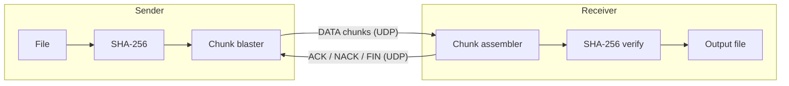
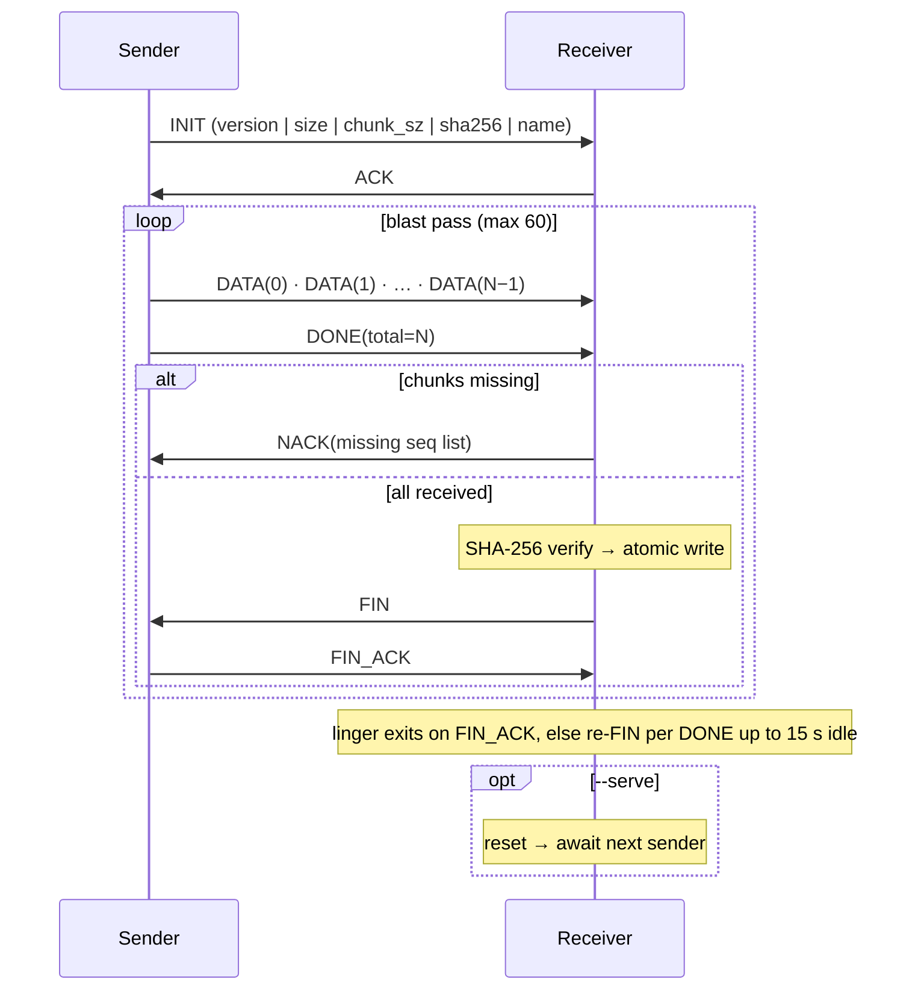
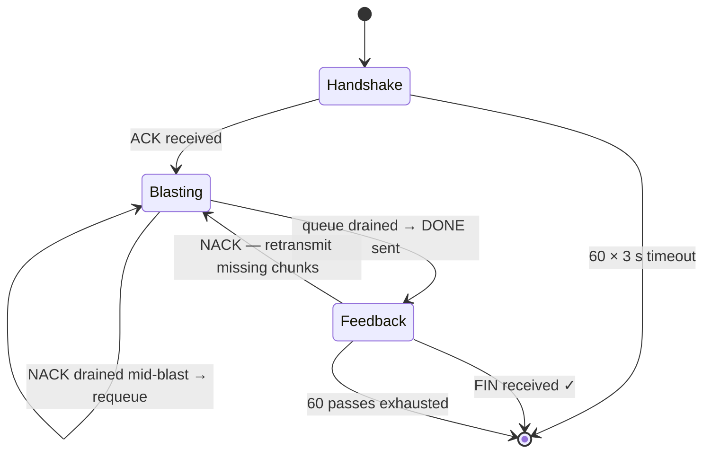
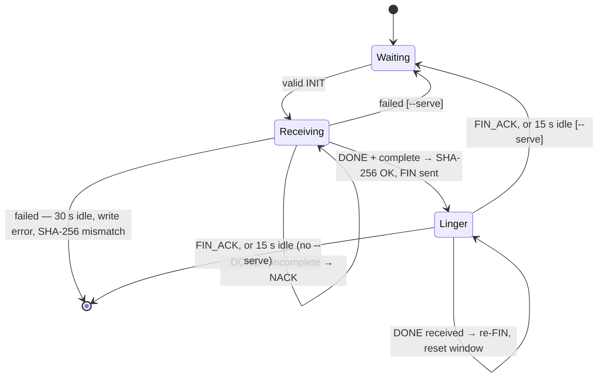

# udpcp

[](https://github.com/benner/udpcp/actions/workflows/lint.yml)
[](https://github.com/benner/udpcp/actions/workflows/test.yml)
[](https://github.com/benner/udpcp/actions/workflows/integration.yml)

UDP file copy — blast-and-NACK protocol with SHA-256 end-to-end integrity.

The sender blasts every chunk over UDP without waiting for per-chunk
acknowledgements; the receiver reports only what it missed; missing chunks are
retransmitted in later passes until an end-to-end SHA-256 check passes. This
helps on lossy or high-latency links where TCP's per-ack round-trips limit
throughput.

Written in Rust with a clap-based CLI; ships static musl binaries and Debian
packages for x86\_64 and aarch64 Linux.

## Architecture



## Protocol

### Packet flow



### Sender states



### Receiver states



### Wire format

All packets share a 7-byte header:

| Offset | Field | Size | Notes |
| ------ | ----- | ---- | ----- |
| 0 | `typ` | 1 B | Packet type (1–7) |
| 1–4 | `seq` | 4 B | Chunk index or chunk count (big-endian) |
| 5–6 | `pay_len` | 2 B | Payload length in bytes (big-endian) |

Packet types:

| Value | Name | Direction | `seq` | Payload |
| ----- | ---- | --------- | ----- | ------- |
| 1 | `INIT` | S → R | 0 | File metadata (see below) |
| 2 | `ACK` | R → S | 0 | — |
| 3 | `DATA` | S → R | chunk index | Chunk bytes |
| 4 | `DONE` | S → R | total chunks | — |
| 5 | `NACK` | R → S | missing count | Missing chunk indices (4 B BE each) |
| 6 | `FIN` | R → S | 0 | — |
| 7 | `FIN_ACK` | S → R | 0 | — |

`INIT` payload layout:

| Offset | Field | Size | Notes |
| ------ | ----- | ---- | ----- |
| 0 | `version` | 1 B | Protocol version — `1`, or `2` with `--verify` |
| 1–8 | `size` | 8 B | File size in bytes (big-endian) |
| 9–12 | `chunk_sz` | 4 B | Chunk size in bytes (big-endian) |
| 13–44 | `hash` | 32 B | SHA-256 of the complete file |
| 45+ | `name` | var | Original filename, NUL-terminated UTF-8 |

The receiver learns the chunk size from `INIT` and adapts; the `--chunk` flag
is sender-only. The output file is written atomically via a `.tmp` file that is
renamed to the final name only after SHA-256 verification succeeds.

## Quick start

```sh
# from repo root
cargo build --release
# binary: target/release/udpcp

# receiver
./target/release/udpcp recv 9000

# sender
./target/release/udpcp send archive.tar.gz 203.0.113.10:9000
```

## CLI reference

```text
udpcp send <file> <host:port> [send flags]
udpcp recv <port> [outfile] [recv flags]
```

Every flag belongs to the subcommand it affects and goes after it, e.g.
`udpcp send --chunk 980 file host:9000` or `udpcp recv 9000 --serve`.

`send` flags:

| Flag | Default | Description |
| ---- | ------- | ----------- |
| `--bw` | 512 KiB/s | Throttle; 0 = unlimited |
| `--chunk` | 1400 B | UDP payload per chunk (1–65500) |
| `--progress` | off | Print live progress during transfer |
| `--jsonl` | off | Emit one JSON object per line instead of human output |
| `--verify` | off | Prepend SHA-256 to each chunk so the receiver can detect corruption (protocol v2) |
| `--handshake-attempts` | 60 | INIT attempts before giving up |
| `--retransmit-passes` | 60 | Blast/NACK passes before giving up |
| `--retransmit-timeout` | 3s | Per-attempt wait for ACK/feedback |
| `--nack-timeout` | 500ms | Extra wait after first NACK to batch more |

`recv` flags:

| Flag | Default | Description |
| ---- | ------- | ----------- |
| `--progress` | off | Print live progress during transfer |
| `--jsonl` | off | Emit one JSON object per line instead of human output |
| `--serve` | off | Loop after each transfer |
| `--linger` | 15s | How long to re-send FIN after transfer |
| `--idle-timeout` | 30s | How long to wait for the next packet before declaring the sender gone |
| `--nack-holdoff` | 20ms | How long a gap may persist before it is NACKed, to absorb reordering |

Duration flags accept a unit suffix (`20ms`, `3s`, `2m`); a bare number is
rejected. Raise `--idle-timeout` when a bandwidth-limited sender may pause
longer than 30 s between passes.

With `--jsonl`, status is emitted as [JSON Lines](https://jsonlines.org) on
stdout — one object per line, each tagged with an `"event"` field
(`sending`/`receiving`/`completed`/`saved`/`bad_init`/…) — for piping into `jq`
or a monitoring tool. Like the human output, `--progress` controls the noisier
events: adding it includes `progress` (throttled to one line per whole percent),
`pass`, and `missing`.

The receiver NACKs a gap as soon as it has persisted past `--nack-holdoff`
rather than waiting for the sender's end-of-pass `DONE`, and the sender folds
those NACKs into the blast it is still sending. On a high-latency path this
overlaps loss recovery with the initial blast instead of paying a round-trip
per pass. Lowering the holdoff recovers loss sooner at the cost of more
redundant retransmits when packets are merely reordered.

### Serve mode

Without `--serve` the receiver exits after delivering one file. With `--serve`
it resets once the sender confirms the close (a `FIN_ACK`, or the linger window
elapses) and listens for the next sender, so back-to-back transfers work without
restarting the process. Stray `DONE` packets from a previous sender are absorbed
during linger and do not disturb the reset state.

A failed transfer — idle timeout, write error, or SHA-256 mismatch — does not
stop a serving receiver either: it reports the failure (`transfer failed: …`
on stderr, or a `failed` JSONL event), discards the partial `.tmp` file, and
goes back to listening. Without `--serve` the same failure exits with an error.

```sh
udpcp recv 9000 --serve          # loop indefinitely
```

## Security model

udpcp has no authentication or encryption. Any host that can reach the
receiver's UDP port can deliver a file: the filename is sanitized (path
components and control characters are rejected), but the content and its
SHA-256 are supplied by the sender — the integrity check protects against
transport corruption, not against a malicious peer. A sender can create or
overwrite `<name>` and `<name>.tmp` in the receiver's working directory (or
the explicit output path).

Run the receiver only on trusted networks or inside an encrypted tunnel such
as WireGuard.

> **Planned**: pre-shared-key INIT authentication (HMAC-SHA256 over the INIT
> payload) so a receiver only accepts transfers from peers holding the key.

## MTU tuning

Link MTU varies by path. Standard Ethernet is 1500 B; some paths are as low
as **1024 B**.

Safe maximum chunk size at link MTU 1024:

```text
1024 − 20 (IP) − 8 (UDP) − 7 (udpcp header) = 989 B
```

Use `--chunk 980` as a conservative default on such paths:

```sh
udpcp send --chunk 980 archive.tar.gz 203.0.113.10:9000
```

Oversized chunks fragment silently — fragmented UDP datagrams are frequently
dropped by firewalls and NAT devices, causing unnecessary retransmit passes with
no indication of why. The `--chunk` flag tunes this per path without recompiling.

> **Planned**: MTU auto-detection (query the outbound interface at send time) and
> chunk-size negotiation (receiver advertises its limit in the ACK packet).

## Building

```sh
cargo build --release                  # native binary
```

### Static builds

```sh
just build-static    # static x86_64 Linux    → dist/udpcp-linux-x86_64
just build-rpi       # static aarch64 Linux   → dist/udpcp-linux-aarch64
just dist            # both cross-compiled targets
```

### Debian packages

```sh
just deb-amd64    # → dist/udpcp_<version>_amd64.deb
just deb-arm64    # → dist/udpcp_<version>_arm64.deb
just deb          # both architectures
```

The `.deb` packages install the statically-linked musl binary to `/usr/bin/udpcp`
and have no runtime dependencies, so they work on any Debian or Ubuntu release.

One-time setup:

```sh
# musl target for static x86_64 builds
rustup target add x86_64-unknown-linux-musl
sudo pacman -S musl      # Arch; adjust for your distro

# cross for aarch64 builds (needs podman or docker)
cargo install cross

# cargo-deb for .deb packaging
cargo install cargo-deb
```

## Testing

### Unit tests

```sh
cargo test
```

The suite includes an in-process chaos proxy — a UDP relay that injects
configurable packet loss and latency — exercising empty files, single-byte
files, exact-chunk boundaries, multi-chunk transfers, and combined loss+latency
scenarios. No root or container runtime required.

### Coverage

Line coverage is measured with [`cargo-llvm-cov`](https://github.com/taiki-e/cargo-llvm-cov):

```sh
cargo llvm-cov
```

Every pull request gets a coverage comment comparing it against the latest
`main` baseline. The comment is posted from the base repository after the PR's
test run finishes, so it works for forks without granting them write access.

### Container integration tests

Sender and receiver run in separate Alpine containers on an isolated bridge
network. `tc netem` is applied inside the receiver container (`NET_ADMIN`
capability) to simulate adverse network conditions. Auto-detects `podman`
(preferred) or `docker`; override with `CONTAINER_RUNTIME=docker`.

```sh
./scripts/netem-tests.sh
```

| Scenario | Delay | Loss |
| -------- | ----: | ---: |
| `basic` | — | — |
| `delay_20ms` | 20 ms | — |
| `delay_100ms` | 100 ms | — |
| `loss_5pct` | — | 5% |
| `loss_15pct` | — | 15% |
| `delay_20ms_loss10` | 20 ms | 10% |
